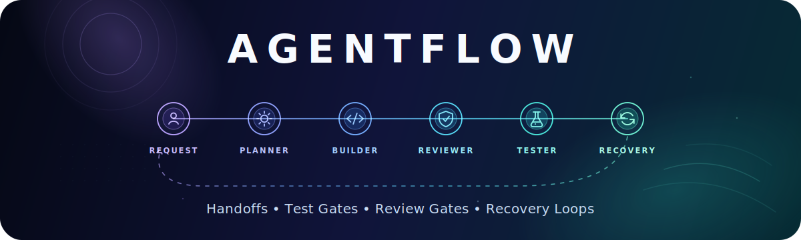
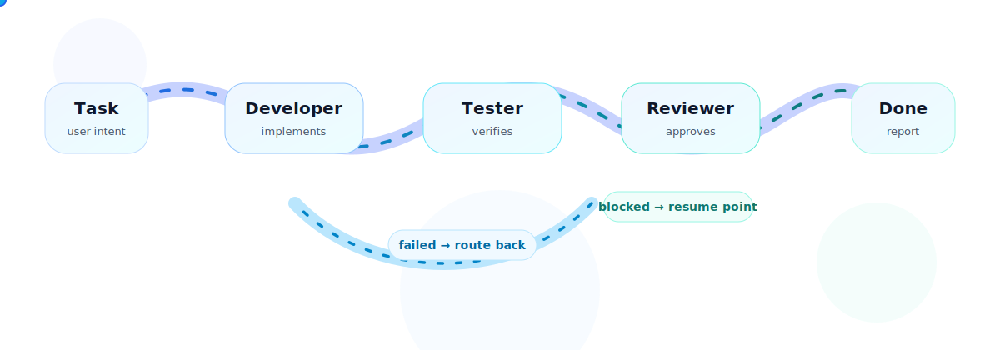

<p align="center">
  
</p>

# agentflow

`agentflow` is a Claude Code skill for running disciplined multi-role coding workflows inside one Claude Code session.

It turns an open-ended assistant session into a structured flow where implementation, verification, review, routing, and final reporting stay explicit.

```txt
Developer writes. Tester verifies. Reviewer approves. You define the flow.
```

> [!NOTE]
> `agentflow` is currently a Claude Code skill, not an external CLI. Role permissions such as `can_edit` and `can_run_commands` are prompt-level workflow constraints; actual tool confirmation still follows your Claude Code permission settings.

## Why agentflow?

Claude Code is powerful, but complex work benefits from separation of responsibilities. `agentflow` gives each step a clear role, handoff contract, and decision vocabulary so a task does not quietly skip testing or review.

Use it when you want:

- built-in workflows for bug fixes, features, refactors, security work, and quick changes;
- sequential role execution instead of one agent doing everything at once;
- required test and review gates;
- failure routing back to the right role;
- blocked-state reporting and resumable context;
- custom YAML workflows and custom role prompts.

<p align="center">
  
</p>

## Repository layout

```txt
claude/skills/agentflow/                 # publishable Claude Code skill source
  SKILL.md                               # command behavior and workflow runner rules
  templates/                             # built-in workflow templates
  roles/                                 # built-in role prompts
  examples/
    workflow-templates/                  # copyable custom workflow examples
    role-templates/                      # copyable custom role prompt examples
```

The local `.claude/` directory is for machine-specific Claude Code settings and local testing. It is not the product source.

## Install locally

After cloning this repo, copy the skill into your Claude Code skills directory:

```bash
cp -R claude/skills/agentflow ~/.claude/skills/
```

Then start Claude Code in any project and run:

```txt
/agentflow list
```

## Quick start

List the built-in workflow templates:

```txt
/agentflow list
```

Inspect a workflow before running it:

```txt
/agentflow show bugfix
```

Run a built-in workflow:

```txt
/agentflow run bugfix "fix login redirect bug"
```

Run a custom workflow YAML file:

```txt
/agentflow validate ./claude/skills/agentflow/examples/workflow-templates/strict-bugfix.yaml
/agentflow run ./claude/skills/agentflow/examples/workflow-templates/strict-bugfix.yaml "fix login redirect bug"
```

## Commands

| Command | Purpose |
| --- | --- |
| `/agentflow list` | Show built-in workflow templates. |
| `/agentflow show <template>` | Show a built-in template's flow, roles, rules, and failure routes. |
| `/agentflow validate <template.yaml>` | Validate a custom workflow YAML file without running it. |
| `/agentflow run <template> "<task>"` | Run a built-in workflow template for a task. |
| `/agentflow run <template.yaml> "<task>"` | Run a custom workflow YAML file for a task. |

Built-in templates are addressed by name. Custom templates are addressed by explicit YAML file path.

## Built-in workflows

| Template | Flow | Best for |
| --- | --- | --- |
| `bugfix` | Investigator → Developer → Tester → Reviewer | Debugging and fixing defects with final review. |
| `feature` | Architect → Developer → Tester → Reviewer | Adding behavior with design, implementation, verification, and review. |
| `refactor` | Architect → Developer → Regression Tester → Reviewer | Behavior-preserving changes with regression focus. |
| `security` | Developer → Security Reviewer → Tester → Senior Reviewer | Security-sensitive changes with senior approval. |
| `quick` | Developer → Tester | Small changes that still need independent verification. |

## Workflow decisions

Roles return structured decisions that the workflow runner normalizes for routing:

| Role type | Raw decisions | Meaning |
| --- | --- | --- |
| Developer | `implemented`, `blocked` | Implementation handoff is ready, or user input is needed. |
| Tester / Regression Tester | `passed`, `failed`, `blocked` | Verification passed, repair is needed, or verification is blocked. |
| Reviewer roles | `approved`, `changes_requested`, `blocked` | Review approved, changes are required, or review is blocked. |

`failed` routes through the template's `fail_to` path when configured. `blocked` stops the workflow with a resume point so the user can provide missing information and continue from the blocked role by default.

## Custom workflow templates

Custom workflows are YAML files with roles, routes, a start role, and workflow rules.

```yaml
name: strict-bugfix
description: Debug and fix a defect with investigation, testing, and final review gates.

roles:
  investigator:
    title: Investigator
    uses: builtin/investigator
    can_edit: false
    can_run_commands: true
    pass_to: developer

  developer:
    title: Developer
    uses: builtin/developer
    can_edit: true
    can_run_commands: true
    pass_to: tester

  tester:
    title: Tester
    uses: builtin/tester
    can_edit: true
    can_run_commands: true
    pass_to: reviewer
    fail_to: developer

  reviewer:
    title: Reviewer
    uses: builtin/reviewer
    can_edit: false
    can_run_commands: true
    pass_to: done
    fail_to: developer

flow:
  start: investigator

rules:
  max_loops: 2
  require_tests: true
  require_final_review: true
```

Copyable examples live in:

```txt
claude/skills/agentflow/examples/workflow-templates/
```

Included examples:

- `strict-bugfix.yaml`
- `docs-only.yaml`
- `security-hotfix.yaml`
- `quick-no-review.yaml`

## Custom role prompts

A role can use a built-in prompt:

```yaml
developer:
  title: Developer
  uses: builtin/developer
  can_edit: true
  can_run_commands: true
  pass_to: tester
```

A role can also combine a built-in prompt with extra instructions:

```yaml
docs-writer:
  title: Docs Writer
  uses: builtin/developer
  prompt: |
    Focus only on documentation changes.
    Keep edits concise, accurate, and scoped to the user's request.
  can_edit: true
  can_run_commands: true
  pass_to: docs-reviewer
```

If you write a fully custom role prompt without `uses`, include:

- role responsibility;
- what the role may and must not do;
- decision vocabulary;
- required output structure;
- handoff destination;
- pass, fail, and block conditions;
- how the role respects required test and review gates.

Copyable role prompt examples live in:

```txt
claude/skills/agentflow/examples/role-templates/
```

Included examples:

- `product-reviewer.md`
- `api-reviewer.md`
- `docs-reviewer.md`
- `migration-reviewer.md`

## Verification boundaries

Developer handoffs describe what counts as core verification, what requires external or runtime access, and what is not required for the change.

Tester and Regression Tester then assess that boundary before deciding whether missing environment access is a passable risk or a blocker.

This helps avoid unnecessary stops when, for example, the current repo can verify the core behavior but a full staging or end-to-end runtime is not available.
